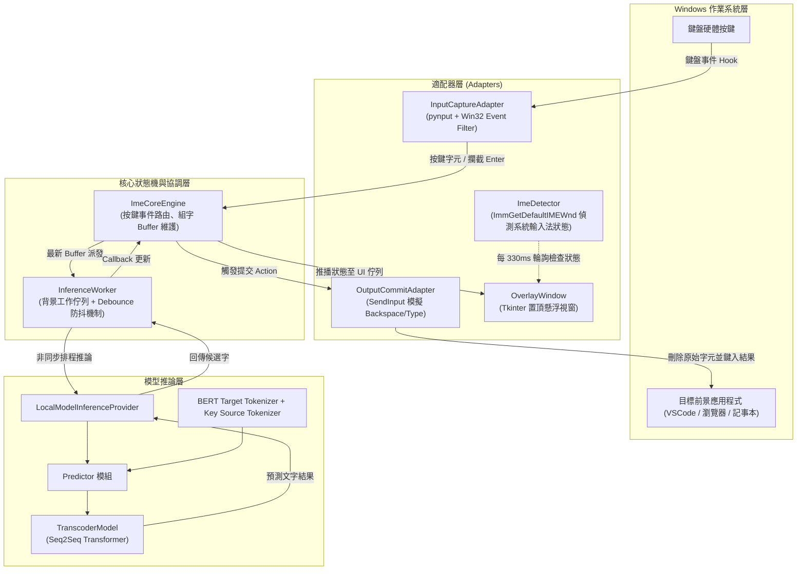
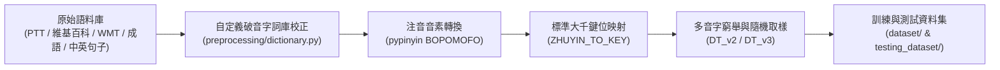

# 智慧中英混打注音輸入法 (Smart Code-Switching Zhuyin IME)

基於 **端到端 Transformer (Seq2Seq)** 架構與 **Windows Win32 API** 實現的智慧注音輸入系統。本專題旨在徹底解決台灣使用者在鍵盤輸入繁體中文、英文字詞與中英夾雜語句時，需頻繁手動切換輸入法中英模式（Shift / CapsLock）的問題。

---

## 目錄 Contents

- [專案簡介與核心理念](#-專案簡介與核心理念)
- [核心痛點與解決方案](#-核心痛點與解決方案)
- [系統架構與流程圖](#-系統架構與流程圖)
- [模型設計與解碼演算法](#-模型設計與解碼演算法)
- [語料庫與資料前處理管線](#-語料庫與資料前處理管線)
- [實驗評估與成效表現](#-實驗評估與成效表現)
- [專案目錄結構](#-專案目錄結構)
- [環境需求與安裝步驟](#-環境需求與安裝步驟)
- [使用與執行指南](#-使用與執行指南)
  - [1. 啟動輸入法主程式](#1-啟動輸入法主程式)
  - [2. 輕量測試模式 (免權重)](#2-輕量測試模式-免權重)
  - [3. 模型訓練與測試](#3-模型訓練與測試)
  - [4. 模型精確率評估](#4-模型精確率評估)
  - [5. 語料前處理與轉碼](#5-語料前處理與轉碼)
- [按鍵行為與互動操作規範](#-按鍵行為與互動操作規範)
- [技術亮點與工程優化](#-技術亮點與工程優化)
- [未來擴充與展望](#-未來擴充與展望)

---

## 專案簡介與核心理念

在台灣現行的輸入法生態中，無論微軟新注音、自然輸入法或其他主流輸入法，皆採用「模式切換制」（中文模式 vs 英文模式）。當使用者需要輸入中英夾雜的句子（如日常口語「今天天氣很 good 適合 go out」或專業對話「我在 study machine learning」）時，往往需要頻繁切換輸入模式；若忘記切換，就會打出無意義的注音亂碼（如 `ji3vu;3ck coffeey94cafez;4nj/ `）。

**本專題的核心理念是：輸入者無須關注目前是中文還是英文模式，一律以標準大千鍵位鍵入字元，由端到端深度學習模型直接轉碼為預期文字。**

- **輸入範例**：`ji3lovesu3`
- **即時預測**：逐鍵推論（`j` -> `j`，`ji` -> `窩`，`ji3` -> `我`，...）
- **最終輸出**：`我love你`

---

## 核心痛點與解決方案

| 比較項目 | 傳統注音輸入法 | 本專題智慧輸入法 |
| :--- | :--- | :--- |
| **輸入模式切換** | 需頻繁點擊 `Shift` / `CapsLock` 切換中英 | **零切換**：始終處於全域捕捉模式，自動判定中英文詞段 |
| **中英夾雜處理** | 英文單字極易誤觸注音拼字，造成打字中斷 | 原生支援 **Code-Switching（中英混合編碼）** 轉碼 |
| **打字流暢度** | 需手動選字或頻繁修正模式 | **雙執行緒非同步推論 + 防抖機制**，打字不掉幀、不卡頓 |
| **系統整合度** | 常因熱鍵衝突或搶焦點造成目標視窗失焦 | **低階 Win32 事件過濾 + 游標防回灌機制**，相容各應用程式 |

---

## 系統架構與流程圖

系統採用分層解耦的 **Ports & Adapters (Hexagonal)** 架構，將 Windows 系統原生操作、非同步推論工作器、深度學習模型與核心狀態機嚴密隔離：



### 元件說明

1. **InputCaptureAdapter (`src/adapters/input_capture.py`)**：
   - 使用 `pynput` 全域監聽鍵盤事件。
   - 在 Windows 環境透過 `win32_event_filter` 攔截低階鍵盤事件（`VK_RETURN = 0x0D`），防止在目標編輯視窗提前觸發換行或送出。
2. **ImeCoreEngine (`src/core/engine.py`)**：
   - 管理輸入法生命週期（組字緩衝區 `buffer`、候選列表 `candidates`、選取索引 `selected_index`）。
   - 負責將鍵盤輸入字元分派至對應動作（Esc 清空、Backspace 刪退、Enter 提交、Up/Down 換字）。
3. **InferenceWorker (`src/core/worker.py`)**：
   - 解決神經網路推論耗時與鍵盤監聽極速響應的矛盾。
   - 內建 **防抖 (Debounce)** 機制：當使用者打字極快時，工作佇列會自動拋棄積壓的過期請求，僅對最後一個輸入字串執行推論，大幅減少 GPU/CPU 負載。
4. **OutputCommitAdapter (`src/adapters/output_commit.py`)**：
   - 協同暫停輸入捕捉器，防止模擬按鍵造成事件回灌與死循環。
   - 呼叫 Windows API `GetAsyncKeyState(0x0D)` 輪詢確認實體 Enter 鍵已放開後，依據 `replace_len` 發送 Backspace，再精準鍵入預測文字。
5. **OverlayWindow (`src/adapters/overlay_ui.py`)**：
   - 輕量置頂 Tkinter 懸浮窗，顯示目前的輸入模式、Buffer、候選字清單與即時除錯訊息。
   - 內建 `_check_ime_state` 週期輪詢前景視窗的 Windows 輸入法狀態，若使用者切換到系統中文輸入法則自動暫停捕捉，避免輸入法衝突。

---

## 模型設計與解碼演算法

本專題將「鍵位序列轉中英文文字」視為標準的 **Sequence-to-Sequence (Seq2Seq)** 序列轉碼問題。

### 1. 模型架構 (`TranscoderModel`)

- **架構類型**：標準 Transformer Encoder-Decoder 架構
- **Embedding 維度 (`d_model`)**：`512`
- **多頭注意力 (`nhead`)**：`8`
- **層數**：Encoder 6 層、Decoder 6 層
- **位置編碼**：正弦餘弦位置編碼 (`PositionalEncoding`)
- **遮罩機制 (`Target Mask`)**：自回歸因果三角矩陣遮罩 (`torch.triu`)，確保解碼器只能根據已生成的 Token 進行注意力計算。

### 2. Tokenizer 設計 (`dictionary.py`)

- **Source Tokenizer (`KeySourceTokenizer`)**：
  - 手動設計按鍵對應字典，共約 50～60 個 Token。
  - 特殊字元：`<PAD>` (0)、`<SOS>` (1)、`<EOS>` (2)、`<UNK>` (3)。
  - 涵蓋範圍：英文字母 `a-z`、數字 `0-9`、注音聲調與鍵位常用符號 `.,/;+-=[]` 與空白鍵。
- **Target Tokenizer (`LabelTargetTokenizer`)**：
  - 基於 Hugging Face 預訓練之 `bert-base-chinese` 字典（Vocab Size: 21,128+）。
  - 自動加入空白字元 Token (`" "`)，確保英文單字之間的空格能被完整還原。

### 3. 解碼與防鬼打牆策略 (`predictor.py`)

- **貪婪搜索 (Greedy Search)**：自 `<SOS>` (`[CLS]`) 開始逐步前向推論。
- **重複懲罰機制 (Repetition Penalty)**：
  ```python
  if len(result_ids) >= 1:
      last_token = result_ids[-1]
      logits[0, last_token] -= 10.0  # 強行壓低前一個 Token 的機率，防範自回歸生成陷入循環死迴圈
  ```
- **後處理正規化**：
  - 使用 Regex 壓制多餘的連續空格：`re.sub(r'\s+', ' ', text)`。
  - 自動消除中文字之間的異常空格，同時保留英文字詞之間的正常間隔：`re.sub(r'([\u4e00-\u9fa5])\s+([\u4e00-\u9fa5])', r'\1\2', text)`。

---

## 語料庫與資料前處理管線

為了讓模型能同時學會「純中文」、「純英文」以及「中英混合 (Code-Switching)」的鍵盤輸入習慣，專案設計了高併發的前處理管線：



### 1. 原始語料集組成 (`original_dataset/`)
- `ch_corpus.txt` / `pure_short_ch_corpus.txt`：一般中文語料與短中文句子。
- `ptt_corpus.txt` / `ptt_mixed_corpus.txt`：PTT 論壇日常口語、網路流行用語。
- `en_corpus.txt` / `english_sentences.txt`：常用英文日常對話與書面語句。
- `mixed_2000_sentences.txt`：2,000 句人工與合成之中英夾雜語句（如「我想喝coffee在cafe放鬆」）。
- `wmt_paired_corpus.txt` / `idiom_corpus.jsonl`：翻譯平行語料與常用四字成語。

### 2. 鍵位映射與破音字處理
- **鍵盤對應表 (`ZHUYIN_TO_KEY`)**：
  將 37 個注音符號與 4 個聲調精準對應至標準鍵盤（例如 `ㄅ` -> `1`、`ㄆ` -> `q`、`ㄧ` -> `u`、`ˇ` -> `3`、`ˋ` -> `4` 等）。注音一聲以空格鍵（` `）代表。
- **繁體多音字/破音字特例校正 (`preprocessing/dictionary.py`)**：
  內建超過 100 組常用詞彙與單字注音修正字典（如「音樂」`yuè`、「便宜」`pián`、「還錢」`huán`、「處境」`chǔ`），校正 `pypinyin` 預設讀音與台灣繁體中文發音之差異。
- **高併發資料生成 (`preprocessing/DT_v3.py`)**：
  使用 Python `ProcessPoolExecutor` 配合 `itertools.product` 窮舉多音字的所有鍵位組合，批量產生數十萬筆 `按鍵序列 \t 目標文字` 格式之訓練集。

---

## 📈 實驗評估與成效表現

### 1. 評估指標
評估腳本 (`model/accuracy.py`) 使用以下兩大指標衡量推論品質：
- **最長子序列精確率 (Subsequence Accuracy)**：衡量預測字串在順序完整性上相對於真實標籤的涵蓋比例。
- **最長子字串精確率 (Substring Accuracy)**：衡量最長連續完全匹配字串的長度比例。

### 2. 測試資料集
- **`output1.txt`**：純中文測試集（2,000 句）
- **`output2.txt`**：純英文測試集（2,000 句）
- **`output3.txt`**：中英混合 Code-Switching 測試集（2,050 句）

### 3. 實驗成果數據對比

專案針對不同輸入序列長度限制（Sequence Length 32 至 64）進行系統性迭代與評估，每個版本皆同時評估**最長子序列 (Subsequence)** 與 **最長子字串 (Substring)** 準確率。

#### 📊 代表性模型效能對比表 (len32 ~ len64)

各長度最佳／具代表性模型之評估數據如下：

| 模型配置 / 長度 | 中文 (output1)<br/>子序列 | 中文 (output1)<br/>子字串 | 英文 (output2)<br/>子序列 | 英文 (output2)<br/>子字串 | 混打 (output3)<br/>子序列 | 混打 (output3)<br/>子字串 |
| :--- | :---: | :---: | :---: | :---: | :---: | :---: | :--- |
| **len32 (v4)** | 78.53% | 36.98% | 56.11% | 32.66% | 39.85% | 27.73% |
| **len48 (v5)** | 89.31% | 37.47% | 55.99% | 35.02% | 43.50% | 33.29% |
| **len52 (v1)** | 89.29% | 37.45% | 59.39% | 50.44% | 50.90% | 36.95% |
| **len53 (v1)** | 86.69% | 37.20% | 52.51% | 41.66% | 47.39% | 37.33% |
| **len54 (v6)** | 89.44% | 37.50% | 56.29% | 46.16% | 50.38% | 41.42% |
| **len55 (v1)** | 89.48% | **37.62%** | 62.50% | 46.30% | **55.35%** | 40.68% |
| **len56 (v1)** | 89.39% | 37.54% | 61.89% | 43.97% | 50.91% | 39.55% |
| **len56 (v5)** | 91.30% | 37.48% | 48.67% | 40.73% | 48.01% | 39.24% |
| **len57 (v2)** | 89.03% | 37.48% | 58.48% | 42.27% | 46.73% | 38.17% |
| **len58 (v2)** | 90.91% | 37.48% | 60.80% | 50.09% | 52.47% | 41.62% |
| **len58 (v6)** | **91.48%**| 37.45% | 50.68% | 43.24% | 47.99% | 40.15% |
| **len59 (v1)** | 87.17% | 37.38% | 60.03% | 41.18% | 51.13% | 38.13% |
| **len60 (v1)** | 87.82% | 37.49% | 64.17% | 51.75% | 54.69% | 42.37% |
| **len61 (v1)** | 90.66% | 37.23% | 62.25% | 44.68% | 51.54% | 40.73% |
| **len62 (v2)** | 91.12% | 37.41% | 55.32% | 44.39% | 53.73% | 42.34% |
| **len63 (v1)** | 86.97% | 37.20% | **70.89%** | **55.67%** | 52.14% | **42.88%** |
| **len64 (v1)** | 83.84% | 37.30% | 44.17% | 34.59% | 36.46% | 30.49% |


### 4. 實驗分析與核心觀察

1. **序列長度擴展效應 (len32 -> len52~len62)**：
   - **純中文 (output1)**：子序列準確率由早期 `len32` 的 78.53% 快速增長並於 `len52` 起穩定站上 **90%**，在 `len58 (v6)` 創下全實驗最高 **91.48%**。子字串準確率則受限於中文斷詞長度特性，穩定維持在 **37.2% ~ 37.6%** 之間。
   - **純英文 (output2)**：子序列準確率在 `len54`、`len55`、`len60` 及 `len63` 多次突破 60%~70%，其中 `len63 (v1)` 的子序列 (**70.89%**) 與連續完全匹配的子字串 (**55.67%**) 皆為全場最高。
   - **中英混打 (output3)**：作為本專題最核心之轉碼任務，混打子序列由 `len32` 的 39.85% 成長至 `len55 (v1)` 的最高 **55.35%**；子字串（連續無失真語段）亦從 27.73% 躍升至 **42.88%** (`len63 v1`) 與 **42.37%** (`len60 v1`)，證明加長上下文序列能有效幫助注意力機制捕捉跨語言切換邊界。

2. **最佳效能甜蜜點 (Sweet Spot: len55 ~ len62)**：
   - 在 `len55` 至 `len62` 區間，模型在「純中文」、「純英文」與「中英混打」三者間展現了極佳的平衡泛化力。
   - **最佳平衡推薦**：`len58 (v2)`（中文 90.91%、英文 60.80%、混打 52.47%）與 `len62 (v2)`（中文 91.12%、英文 55.32%、混打 53.73%），在兼顧中文高召回率的同時，保有強韌的中英夾雜還原能力。

3. **長度上限與效能衰退現象 (len64)**：
   - 當長度拓展至 `len64` 時，所有版本（v1~v4）均呈現普遍性下滑（中文降至 78%~83%、混打跌破 37%），研判因過長序列導致 Padding Token 比例增加、自注意力權重稀釋，驗證在現有語料長度分佈下，長度設定於 **52~62** 具備最佳性價比與推論品質。

> 訓練損失 (`loss.txt`) 從初期的 **3.854** 穩定收斂至 **0.336**，展現 Transformer 在鍵位轉碼任務上的高度學習潛力。

---

## 📂 專案目錄結構

```text
Senior-Project/
├── README.md                      # 專案完整說明文件
├── requirements.txt               # 專案相依 Python 套件清單
├── goal.txt                       # 專題核心目標驗證範例 (ji3lovesu3 -> 我love你)
├── loss.txt                       # 模型訓練 Loss 記錄檔
├── report_*.txt / !report_*.txt   # 各 Sequence Length 與版本之模型精確度測試報告
├── final_transformer_cs_dataset.zip # 完整 Code-Switching 訓練語料壓縮檔
│
├── src/                           # 即時輸入法主應用程式 (Runtime System)
│   ├── app.py                     # 輸入法主程式入口與各模組整合排程
│   ├── config.py                  # 環境設定載入器
│   ├── predictor.py               # 本機模型載入與推論介面
│   ├── transformer_main.py        # Transformer 模型結構定義
│   ├── dictionary.py              # 輸入/輸出端 Tokenizer 定義
│   ├── core/                      # 核心商業邏輯與狀態機
│   │   ├── contracts.py           # 資料契約介面 (CompositionState, CommitAction 等)
│   │   ├── engine.py              # ImeCoreEngine 輸入法核心狀態機
│   │   ├── worker.py              # InferenceWorker 非同步推論工作器 (含防抖)
│   │   ├── inference.py           # 本機 PyTorch 推論實作 (LocalModelInferenceProvider)
│   │   └── test_inference.py      # 輕量測試推論提供者 (SimpleTestInferenceProvider)
│   └── adapters/                  # 系統硬體與外部介面適配器
│       ├── input_capture.py       # pynput 全域鍵盤事件監聽與 Win32 事件攔截
│       ├── output_commit.py       # 鍵盤模擬輸出與 Backspace 退格替換提交器
│       ├── ime_detector.py        # Windows 原生輸入法狀態偵測 (user32 / imm32)
│       └── overlay_ui.py          # Tkinter 置頂懸浮候選窗
│
├── model/                         # 模型訓練、評估與推論工具庫
│   ├── transformer_main.py        # 模型架構定義
│   ├── final_train_v2.py          # Transformer 模型訓練主程式 (含因果遮罩與 tqdm)
│   ├── predictor.py               # 獨立推論介面模組
│   ├── dictionary.py              # Tokenizer 模組
│   ├── accuracy.py                # LCS 子序列與子字串精確率評估腳本
│   ├── test_model.py              # 終端互動式即時推論驗證工具
│   ├── data_utils.py              # 區域標籤 (Zoned Token) 實驗工具
│   ├── test.txt                   # 單行輸入測試檔
│   ├── 指令.txt                   # 訓練快速指令備忘
│   └── Put models in here.txt     # 權重放置提示目錄
│
├── preprocessing/                 # 語料處理與注音鍵位轉碼工具
│   ├── DataTransformer.py         # 基礎注音轉換管線
│   ├── DT_v2.py                   # 多程序平行轉碼腳本 (隨機挑選讀音)
│   ├── DT_v3.py                   # 多程序平行窮舉轉碼腳本 (itertools 完整組合)
│   ├── dictionary.py              # 繁體中文破音字/多音字校正字典
│   └── test.py                    # pypinyin 轉換快速驗證測試
│
├── original_dataset/              # 原始文本語料
│   ├── ch_corpus.txt              # 中文一般語料
│   ├── pure_short_ch_corpus.txt   # 短中文語料
│   ├── ptt_corpus.txt / ptt_mixed_corpus.txt # PTT 論壇日常語料
│   ├── en_corpus.txt / english_sentences.txt # 純英文句子語料
│   ├── mixed_2000_sentences.txt   # 2,000 筆中英混打基準語料
│   └── wmt_paired_corpus.txt      # 雙語對齊語料
│
├── dataset/                       # 經過轉碼處理之訓練集 (output1.txt ~ output9.txt)
└── testing_dataset/               # 測試專用基準資料集 (output1.txt, output2.txt, output3.txt)
```

---

## 環境需求與安裝步驟

### 1. 作業系統與 Python 版本

- **作業系統**：**Windows 10 / 11**
- **Python 版本**：**≥ 3.10**（程式碼採用現代型別標註語法 `X | Y`）

### 2. 安裝相依套件

建議建立專屬虛擬環境（venv 或 conda）：

**有 NVIDIA GPU：**
```powershell
pip install -r requirements.txt
```

**僅使用 CPU（節省空間與下載時間）：**
```powershell
pip install torch --index-url https://download.pytorch.org/whl/cpu
pip install -r requirements.txt --no-deps
pip install pynput transformers pypinyin tqdm
```

---

## 使用與執行指南

### 1. 啟動輸入法主程式

1. **放置模型權重**：
   將訓練好的權重檔（例如 `transcoder_len48_v5.pth` 或 `transcoder_len56_v4.pth`）放置於 `model/` 資料夾下：
   ```text
   model/transcoder_len48_v5.pth
   ```
   > 若欲切換使用的權重檔名，可開啟 [src/predictor.py]修改第 23 行之 `weight_path`。

2. **執行應用程式**：
   在專案根目錄下執行：
   ```powershell
   python -m src.app
   ```
   執行後螢幕左上方將出現置頂的 `Senior Project IME` 懸浮視窗，即可在任一目標應用程式（記事本、瀏覽器、通訊軟體）中開始打字。

---

### 2. 輕量測試模式 (免權重)

若尚未取得大型模型權重檔，可啟用測試模式驗證按鍵捕捉、懸浮視窗與目標視窗替換功能：

```powershell
# PowerShell
$env:ZHUYIN_TEST_MODE="1"
python -m src.app
```

> **測試模式驗證情境**：
> 輸入 `ji3lovesu3` 並按下 `Enter`，程式將驗證能否成功將組字替換為 `我love你`。

---

### 3. 模型訓練與測試

1. **開始訓練**：
   進入 `model/` 目錄並啟動訓練腳本：
   ```powershell
   cd model
   python final_train_v2.py
   ```
   - 訓練程式會自動讀取 `dataset/` 目錄下的所有 `.txt` 檔案。
   - 預設訓練 500 個 Epochs，每 10 輪自動儲存檢查點權重。

2. **終端互動測試**：
   訓練完成或載入權重後，可透過終端機快速輸入鍵位測試轉碼結果：
   ```powershell
   cd model
   python test_model.py
   ```
   輸入 `ji3vu;3t z04`，觀察輸出是否為 `我想吃飯`。

---

### 4. 模型精確率評估

執行評估腳本以計算模型在純中文、純英文與中英混打測試集上的表現：

```powershell
cd model
python accuracy.py
```
程式將逐一載入 `testing_dataset/` 中的 `output1.txt`、`output2.txt`、`output3.txt`，並計算 LCS 子序列與子字串精確率。

---

### 5. 語料前處理與轉碼

若需擴充訓練資料，可使用多核心平行前處理腳本將純文字轉換為鍵位資料對：

```powershell
cd preprocessing
# 執行全組合窮舉轉換 (輸出至 dataset/output1.txt)
python DT_v3.py
```

---

## 按鍵行為與互動操作規範

| 按鍵 | 行為說明 |
| :--- | :--- |
| **可印出字元** (`a-z`, `0-9`, 標點) | 捕捉並原樣累積至組字緩衝區 (`buffer`)，同時觸發背景非同步模型推論。 |
| **空白鍵 (`Space`)** | 視為**注音一聲**（鍵入空格字元至 buffer 中），**非提交鍵**。輸入英文時代表單字分隔。 |
| **回車鍵 (`Enter`)** | **唯一確認提交鍵**。在作業系統層級攔截換行事件，等待推論完成後替換前景文字。 |
| **退格鍵 (`Backspace`)** | 刪除組字緩衝區中的最後一個字元，並重新刷新候選字清單。 |
| **方向鍵 (`Up / Down`)** | 在懸浮選單中移動候選字選取游標。 |
| **取消鍵 (`Esc`)** | 清空當前組字緩衝區與候選字，放棄本次輸入。 |

---

## 技術亮點與工程優化

1. **鍵盤監聽零死鎖 (Lock-free & Non-blocking Hook)**：
   提交文字時會牽涉模擬退格鍵與字元鍵入，為防止 `pynput` 的監聽回呼與 Windows Hook 執行緒發生事件死鎖，在 `src/app.py` 中將 `OutputCommitAdapter.commit_text` 移至獨立背景 Daemon 執行緒中執行。
2. **防抖機制 (Inference Debouncing)**：
   在 `src/core/worker.py` 中實作任務佇列清空機制。當鍵盤輸入頻率高於神經網路單次推論時間時，自動捨棄中間無效的歷史 Buffer，確保推論資源專注於使用者最後敲擊的狀態。
3. **低階鍵盤事件過濾 (Win32 Hook Event Filter)**：
   透過 `win32_event_filter` 攔截 `0x0100 (WM_KEYDOWN)` 與 `0x0104 (WM_SYSKEYDOWN)` 中的 `VK_RETURN` 虛擬鍵碼，徹底避免 Enter 鍵送進目標視窗引發不必要的訊息發送或換行。
4. **實體鍵狀態輪詢防衝突**：
   在模擬 Backspace 之前，呼叫 Windows `GetAsyncKeyState(0x0D)`，確保使用者的實體 Enter 鍵已徹底彈起，避免硬體按鍵與模擬按鍵在 Windows 訊息佇列中產生衝突。
5. **IME 模式感知保護機制**：
   定期透過 `ImmGetDefaultIMEWnd` 與 `SendMessageW` 偵測系統當前輸入模式。若使用者切換至微軟中文輸入法，懸浮視窗將標註警告並暫停鍵盤攔截，完全避免與系統既有輸入法競爭。

---

## 未來擴充與展望

- [ ] **Beam Search 解碼演算法**：目前採用貪婪解碼（Greedy），未來可引入輕量化 Beam Search，提供更多元、高信賴度的 Top-K 候選詞選項。
- [ ] **模型輕量化與邊緣推論**：將 PyTorch 權重匯出為 **ONNX Runtime** 或使用 **TensorRT / OpenVINO** 進行 INT8 量化，將推論延遲降低至 10ms 以內。
- [ ] **跨平台支援**：抽象化作業系統層 API，結合 macOS Accessibility API 與 Linux X11/Wayland 協定，實現全平台通用。
- [ ] **自適應個性化詞庫**：根據使用者日常打字習慣，即時動態微調個人常用詞彙與中英夾雜頻率。

---
